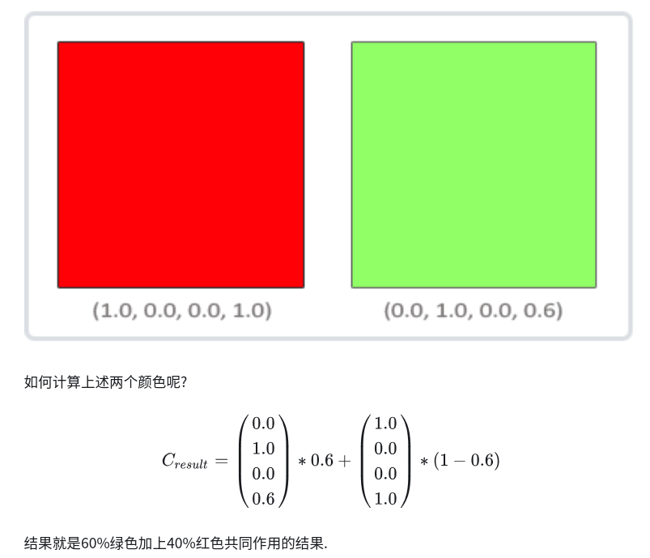

# Blending

- Blend 混合是将源色和目标色以某种方式混合生成特效的技术
- 混合常用来绘制透明或半透明的物体
- 在混合中起关键作用的${\alpha}$值实际上是将源色和目标色按给定比率进行混合
  - ${\alpha}$值为0则完全透明，${\alpha}$值为1则完全不透明
  - 混合操作只能在RGBA模式下进行，颜色索引模式下无法指定${\alpha}$值
  - 物体的绘制顺序会影响到OpenGL的混合处理

```cpp
glEnable( GL_BLEND );   // 启用混合
glDisable( GL_BLEND );  // 禁用关闭混合

// 获得混合的信息

glGet( GL_BLEND_SRC );
glGet( GL_BLEND_DST );
glIsEnable( GL_BLEND );

// 混合函数
// sfactor 源混合因子
// dfactor 目标混合因子
glBlendFunc(GLenum sfactor , GLenum dfactor);
```

OpenGL混合公式

$$
C_{source}=C_{source}*F_{source}+C_{destination}*F_{destination}
$$

- $C_{source}$: 纹理中的颜色分量
- $Ｆ_{source}$: alpha对$C_{source}$的影响
- $C_{destination}$: ColorBuffer中的颜色分量
- $F_{destination}$: alpha对$C_{destination}$的影响



## 混合模式枚举

|混合因子||
|---|---|
|GL_DST_ALPHA|(Ad,Ad,Ad,Ad)|
|GL_DST_COLOR|(Rd,Gd,Bd,Ad)|
|GL_ONE|(1,1,1,1)|
|GL_ONE_MINUS_DST_ALPHA|(1,1,1,1)-(Ad,Ad,Ad,Ad)|
|GL_ONE_MINUS_DST_COLOR|(1,1,1,1)-(Rd,Gd,Bd,Ad)|
|GL_ONE_MINUS_SRC_ALPHA|(1,1,1,1)-(As,As,As,As)|
|GL_SRC_ALPHA|(As,As,As,As)|
|GL_SRC_ALPHA_SATURATE|(f,f,f,1):f=min(As,1-As)|
|GL_ZERO|(0,0,0,0)|

```cpp
glBlendFunc( GL_ONE , GL_ZERO );        // 源色将覆盖目标色
glBlendFunc( GL_ZERO , GL_ONE );        // 目标色将覆盖源色
glBlendFunc( GL_SRC_ALPHA , GL_ONE_MINUS_SRC_ALPHA ); // 是最常使用的
```

> 若源色为 ( 1.0 , 0.9 , 0.7 , 0.8 )
> 
> 源色使用 GL_SRC_ALPHA
> 
> 即 0.8 * 1.0 , 0.8 * 0.9 , 0.8 * 0.8 , 0.8 * 0.7
> 
> 结果为 0.8 , 0.72 , 0.64 , 0.56

> 目标色为 ( 0.6 , 0.5 , 0.4 , 0.3 )
>
> 目标色使用GL_ONE_MINUS_SRC_ALPHA
>
> 即 1 - 0.8 = 0.2
>
> 0.2 * 0.6 , 0.2 * 0.5 , 0.2 * 0.4 , 0.2 * 0.3
>
> 结果为 0.12 , 0.1 , 0.08 , 0.06

- 由此而见，使用这个混合函数，源色的α值决定了结果颜色的百分比
- 这里源色的α值为0.8，即结果颜色中源色占80%，目标色占20%

## 设置混合模式

`glBlendEquation(GLenum mode)`

- GL_FUNC_ADD: 默认选项, 将两个分量相加$C_{result} = C_{source}+D_{destination}$
- GL_FUNC_SUBTRACT: 将两个分量相减$C_{result} = C_{source}-D_{destination}$
- GL_FUNC_REVERSE_SUBTRACT: $C_{result} = C_{destination}-D_{source}$

## 混合流程

```cpp
开启blend
glEnable(GL_BLEND);

设置混合公式
glBlendFunc(GL_SRC_ALPHA, GL_ONE_MINUS_SRC_ALPHA);

对半透明物体排序

先渲染不透明物体
再按顺序渲染半透明物体
```

注意:

一定要先渲染不透明物体, 对透明物体进行排序, 然后依此渲染.
在进行半透明物体渲染时候, 一定要开启深度测试, 关闭深度写入
