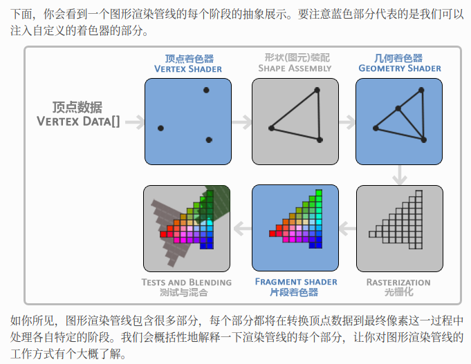
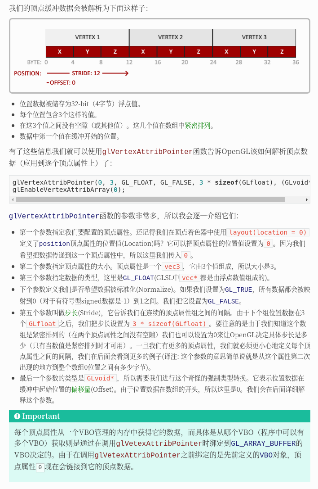
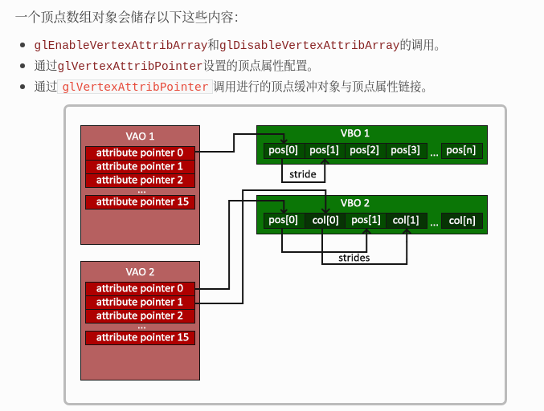
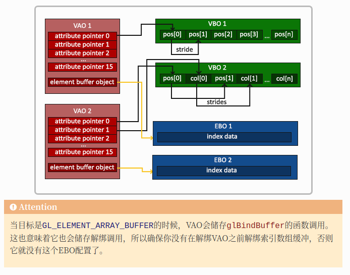
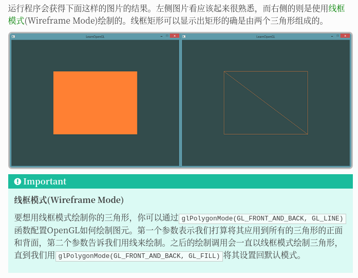

- [OPenGL](#opengl)
  - [Graphics Pipeline](#graphics-pipeline)
  - [vertex shader 顶点着色器](#vertex-shader-顶点着色器)
  - [shape assembly 图元装配](#shape-assembly-图元装配)
  - [eometry Shader 几何着色器](#eometry-shader-几何着色器)
  - [Rasterization 光栅化](#rasterization-光栅化)
  - [fragment shadre 片段着色器](#fragment-shadre-片段着色器)
  - [test and blending](#test-and-blending)
- [顶点](#顶点)
  - [把顶点数据储存在显卡的内存中，用VBO这个顶点缓冲对象管理](#把顶点数据储存在显卡的内存中用vbo这个顶点缓冲对象管理)
- [vertex shader 顶点着色器](#vertex-shader-顶点着色器-1)
  - [编译着色器](#编译着色器)
- [fragment shader 片段着色器](#fragment-shader-片段着色器)
  - [编译着色器](#编译着色器-1)
  - [Shader Program Object 着色器程序](#shader-program-object-着色器程序)
  - [链接顶点属性](#链接顶点属性)
  - [Vertex Array Object, VAO 顶点数组对象](#vertex-array-object-vao-顶点数组对象)
- [索引缓冲对象 Element Buffer Object，EBO or Index Buffer Object，IBO](#索引缓冲对象-element-buffer-objectebo-or-index-buffer-objectibo)

# OPenGL

- 在OpenGL中，任何事物都在3D空间中，而屏幕和窗口却是2D像素数组，这导致OpenGL的大部分工作都是关于把3D坐标转变为适应你屏幕的2D像素
- 3D坐标转为2D坐标的处理过程是由OpenGL的图形渲染管线（Graphics Pipeline，大多译为管线，实际上指的是一堆原始图形数据途经一个输送管道，期间经过各种变化处理最终出现在屏幕的过程）管理的
- 图形渲染管线可以被划分为两个主要部分：第一部分把你的3D坐标转换为2D坐标，第二部分是把2D坐标转变为实际的有颜色的像素

> 2D坐标和像素也是不同的，2D坐标精确表示一个点在2D空间中的位置，而2D像素是这个点的近似值，2D像素受到你的屏幕/窗口分辨率的限制

## Graphics Pipeline

- 图形渲染管线接受一组3D坐标，然后把它们转变为你屏幕上的有色2D像素输出
- 图形渲染管线具有并行执行的特性,它们在GPU上为每一个（渲染管线）阶段运行各自的小程序，从而在图形渲染管线中快速处理你的数据。这些小程序叫做着色器(Shader)
- 有些着色器允许开发者自己配置，这就允许我们用自己写的着色器来替换默认的
- OpenGL着色器是用OpenGL着色器语言(OpenGL Shading Language, GLSL)写成



- vertex data[]: 顶点数组
- Primitive 图元: GL_POINTS、GL_TRIANGLES、GL_LINE_STRIP

## vertex shader 顶点着色器

顶点着色器主要的目的是把3D坐标转为另一种3D坐标，同时顶点着色器允许我们对顶点属性进行一些基本处理


## shape assembly 图元装配

图元装配(Primitive Assembly)阶段将顶点着色器输出的所有顶点作为输入（如果是GL_POINTS，那么就是一个顶点），并所有的点装配成指定图元的形状；本节例子中是一个三角形

## eometry Shader 几何着色器

几何着色器把图元形式的一系列顶点的集合作为输入，它可以通过产生新顶点构造出新的（或是其它的）图元来生成其他形状

## Rasterization 光栅化

会把图元映射为最终屏幕上相应的像素，生成供片段着色器(Fragment Shader)使用的片段(Fragment)在片段着色器运行之前会执行裁切(Clipping)。裁切会丢弃超出你的视图以外的所有像素，用来提升执行效率

> OpenGL中的一个片段是OpenGL渲染一个像素所需的所有数据

## fragment shadre 片段着色器

片段着色器的主要目的是计算一个像素的最终颜色，这也是所有OpenGL高级效果产生的地方。通常，片段着色器包含3D场景的数据（比如光照、阴影、光的颜色等等），这些数据可以被用来计算最终像素的颜色

## test and blending

在所有对应颜色值确定以后，最终的对象将会被传到最后一个阶段，我们叫做Alpha测试和混合(Blending)阶段

- 这个阶段检测片段的对应的深度（和模板(Stencil)）值（后面会讲），用它们来判断这个像素是其它物体的前面还是后面，决定是否应该丢弃
- 也会检查alpha值（alpha值定义了一个物体的透明度）并对物体进行混合(Blend)
- 所以，即使在片段着色器中计算出来了一个像素输出的颜色，在渲染多个三角形的时候最后的像素颜色也可能完全不同

可以看到，图形渲染管线非常复杂，它包含很多可配置的部分。然而，**对于大多数场合，我们只需要配置顶点和片段着色器就行了**。几何着色器是可选的，通常使用它默认的着色器就行了

在现代OpenGL中，我们必须定义至少一个顶点着色器和一个片段着色器（因为GPU中没有默认的顶点/片段着色器）

# 顶点

## 把顶点数据储存在显卡的内存中，用VBO这个顶点缓冲对象管理

```cpp
GLfloat vertices[] = {
    -0.5f, -0.5f, 0.0f,
     0.5f, -0.5f, 0.0f,
     0.0f,  0.5f, 0.0f
};

GLuint VBO; // ertex Buffer Objects 顶点缓冲对象管理这个vertices内存，它会在GPU内存中储存大量顶点　这个缓冲有一个独一无二的ID
glGenBuffers(1, &VBO); // 使用独立id 生成 VBO object
glBindBuffer(GL_ARRAY_BUFFER, VBO); // 顶点缓冲对象的缓冲类型是GL_ARRAY_BUFFER glBindBuffer函数把新创建的缓冲绑定到GL_ARRAY_BUFFER
glBufferData(GL_ARRAY_BUFFER, sizeof(vertices), vertices, GL_STATIC_DRAW); // 把之前定义的顶点数据复制到缓冲的内存
```

现在我们已经把顶点数据储存在显卡的内存中，用VBO这个顶点缓冲对象管理。下面我们会创建一个顶点和片段着色器来真正处理这些数据

# vertex shader 顶点着色器

如果我们打算做渲染的话，现代OpenGL需要我们至少设置一个顶点和一个片段着色器

- 用着色器语言GLSL(OpenGL Shading Language)编写顶点着色器，然后编译这个着色器，这样我们就可以在程序中使用它

```c
#version 330 core

layout (location = 0) in vec3 position;

void main()
{
    gl_Position = vec4(position.x, position.y, position.z, 1.0);
}
```
- 使用in关键字，在顶点着色器中声明所有的输入顶点属性(Input Vertex Attribute)
- 创建一个vec3输入变量position, 通过layout (location = 0)设定了输入变量的位置值(Location)
- 把位置数据赋值给预定义的gl_Position变量，它在幕后是vec4类型的。在main函数的最后，我们将gl_Position设置的值会成为该顶点着色器的输出


## 编译着色器

为了能够让OpenGL使用顶点着色器源码，我们必须在运行时动态编译它的源码

```cpp
GLuint vertexShader;
vertexShader = glCreateShader(GL_VERTEX_SHADER); // 创建顶点着色器

glShaderSource(vertexShader, 1, &vertexShaderSource, NULL); // 把这个着色器源码附加到着色器对象
// glShaderSource函数把要编译的着色器对象作为第一个参数。第二参数指定了传递的源码字符串数量，这里只有一个。第三个参数是顶点着色器真正的源码，第四个参数我们先设置为NULL

GLint success;
GLchar infoLog[512];
glGetShaderiv(vertexShader, GL_COMPILE_STATUS, &success);

if(!success)
{
    glGetShaderInfoLog(vertexShader, 512, NULL, infoLog);
    std::cout << "ERROR::SHADER::VERTEX::COMPILATION_FAILED\n" << infoLog << std::endl;
}
```

# fragment shader 片段着色器

片段着色器全是关于计算你的像素最后的颜色输出

- 在计算机图形中颜色被表示为有4个元素的数组：红色、绿色、蓝色和alpha(透明度)分量，通常缩写为RGBA。当在OpenGL或GLSL中定义一个颜色的时候，我们把颜色每个分量的强度设置在0.0到1.0之间。比如说我们设置红为1.0f，绿为1.0f，我们会得到两个颜色的混合色，即黄色

```c
#version 330 core

out vec4 color;

void main()
{
    color = vec4(1.0f, 0.5f, 0.2f, 1.0f);
}
```

片段着色器只需要一个输出变量，这个变量是一个4分量向量，它表示的是最终的输出颜色，我们应该自己将其计算出来。我们可以用out关键字声明输出变量，这里我们命名为color

## 编译着色器

编译片段着色器的过程与顶点着色器类似，只不过我们使用GL_FRAGMENT_SHADER常量作为着色器类型：

```cpp
GLuint fragmentShader;
fragmentShader = glCreateShader(GL_FRAGMENT_SHADER);
glShaderSource(fragmentShader, 1, &fragmentShaderSource, null);
glCompileShader(fragmentShader);
```

两个着色器现在都编译了，剩下的事情是把两个着色器对象链接到一个用来渲染的着色器程序(Shader Program)中

## Shader Program Object 着色器程序

着色器程序对象(Shader Program Object)是多个着色器合并之后并最终链接完成的版本。如果要使用刚才编译的着色器我们必须把它们链接为一个着色器程序对象，然后在渲染对象的时候激活这个着色器程序。已激活着色器程序的着色器将在我们发送渲染调用的时候被使用

```cpp
// 创建 着色器程序对象
GLuint shaderProgram;
shaderProgram = glCreateProgram();

// 把之前编译的着色器附加到程序对象上，然后用glLinkProgram链接它们
glAttachShader(shaderProgram, vertexShader);
glAttachShader(shaderProgram, fragmentShader);
glLinkProgram(shaderProgram);

glGetProgramiv(shaderProgram, GL_LINK_STATUS, &success);
if(!success) {
    glGetProgramInfoLog(shaderProgram, 512, NULL, infoLog);
  ...
}

// 调用glUseProgram函数，用刚创建的程序对象作为它的参数，以激活这个程序对象
glUseProgram(shaderProgram); // 在glUseProgram函数调用之后，每个着色器调用和渲染调用都会使用这个程序对象（也就是之前写的着色器)了


// ......
// 在把着色器对象链接到程序对象以后，记得删除着色器对象
glDeleteShader(vertexShader);
glDeleteShader(fragmentShader);

// 现在，我们已经把输入顶点数据发送给了GPU，并指示了GPU如何在顶点和片段着色器中处理它
// 但还没结束，OpenGL还不知道它该如何解释内存中的顶点数据，
// 以及它该如何将顶点数据链接到顶点着色器的属性上。我们需要告诉OpenGL怎么做
```

## 链接顶点属性



每个顶点属性从一个VBO管理的内存中获得它的数据，而具体是从哪个VBO（程序中可以有多个VBO）获取则是通过在调用glVetexAttribPointer时绑定到GL_ARRAY_BUFFER的VBO决定的。由于在调用glVetexAttribPointer之前绑定的是先前定义的VBO对象，顶点属性0现在会链接到它的顶点数据。

- 使用glEnableVertexAttribArray，以顶点属性位置值作为参数，启用顶点属性；顶点属性默认是禁用的。
- 自此，所有东西都已经设置好了：我们使用一个顶点缓冲对象将顶点数据初始化至缓冲中，
- 建立了一个顶点和一个片段着色器，
- 并告诉了OpenGL如何把顶点数据链接到顶点着色器的顶点属性

```cpp
// 0. 复制顶点数组到缓冲中供OpenGL使用
glBindBuffer(GL_ARRAY_BUFFER, VBO);
glBufferData(GL_ARRAY_BUFFER, sizeof(vertices), vertices, GL_STATIC_DRAW);
// 1. 设置顶点属性指针
glVertexAttribPointer(0, 3, GL_FLOAT, GL_FALSE, 3 * sizeof(GLfloat), (GLvoid*)0);
glEnableVertexAttribArray(0);
// 2. 当我们渲染一个物体时要使用着色器程序
glUseProgram(shaderProgram);
// 3. 绘制物体
someOpenGLFunctionThatDrawsOurTriangle();
```

按照以上步骤，绘制多个物体时，绑定正确的缓冲对象，为每个物体配置所有顶点属性会非常麻烦，需要一些方法把所有这些状态配置储存在一个对象中，并且可以通过绑定这个对象来恢复状态

## Vertex Array Object, VAO 顶点数组对象

顶点数组对象(Vertex Array Object, VAO)可以像顶点缓冲对象那样被绑定，任何随后的顶点属性调用都会储存在这个VAO中

- 当配置顶点属性指针时，你只需要将那些调用执行一次，之后再绘制物体的时候只需要绑定相应的VAO就行
- 这使在不同顶点数据和属性配置之间切换变得非常简单，只需要绑定不同的VAO就行

> OpenGL的核心模式要求我们使用VAO，所以它知道该如何处理我们的顶点输入。如果我们绑定VAO失败，OpenGL会拒绝绘制任何东西



```cpp
GLuint VAO;
glGenVertexArrays(1, &VAO); // 创建顶点数组对象
```

要想使用VAO，要做的只是使用glBindVertexArray绑定VAO。从绑定之后起，我们应该绑定和配置对应的VBO和属性指针，之后解绑VAO供之后使用。当我们打算绘制一个物体的时候，我们只要在绘制物体前简单地把VAO绑定到希望使用的设定上就行了。这段代码应该看起来像这样：

```cpp
// ..:: 初始化代码（只运行一次 (除非你的物体频繁改变)） :: ..
// 1. 绑定VAO
glBindVertexArray(VAO);
    // 2. 把顶点数组复制到缓冲中供OpenGL使用
    glBindBuffer(GL_ARRAY_BUFFER, VBO);
    glBufferData(GL_ARRAY_BUFFER, sizeof(vertices), vertices, GL_STATIC_DRAW);
    // 3. 设置顶点属性指针
    glVertexAttribPointer(0, 3, GL_FLOAT, GL_FALSE, 3 * sizeof(GLfloat), (GLvoid*)0);
    glEnableVertexAttribArray(0);
//4. 解绑VAO
glBindVertexArray(0);

[...]

// ..:: 绘制代（游戏循环中） :: ..
// 5. 绘制物体
glUseProgram(shaderProgram);
glBindVertexArray(VAO);
someOpenGLFunctionThatDrawsOurTriangle();
glBindVertexArray(0);
```

一个储存了我们顶点属性配置和应使用的VBO的顶点数组对象。一般当你打算绘制多个物体时，你首先要生成/配置所有的VAO(和必须的VBO及属性指针)，然后储存它们供后面使用。当我们打算绘制物体的时候就拿出相应的VAO，绑定它，绘制完物体后，再解绑VAO

- OpenGL给我们提供了glDrawArrays函数，它使用当前激活的着色器，之前定义的顶点属性配置，和VBO的顶点数据（通过VAO间接绑定）来绘制图元

```cpp
glUseProgram(shaderProgram);
glBindVertexArray(VAO);
glDrawArrays(GL_TRIANGLES, 0, 3);
glBindVertexArray(0);
```

glDrawArrays函数第一个参数是我们打算绘制的OpenGL图元的类型。由于我们在一开始时说过，我们希望绘制的是一个三角形，这里传递GL_TRIANGLES给它。第二个参数指定了顶点数组的起始索引，我们这里填0。最后一个参数指定我们打算绘制多少个顶点，这里是3（我们只从我们的数据中渲染一个三角形，它只有3个顶点长）。

# 索引缓冲对象 Element Buffer Object，EBO or Index Buffer Object，IBO

假设我们不再绘制一个三角形而是绘制一个矩形。我们可以绘制两个三角形来组成一个矩形（OpenGL主要处理三角形）。这会生成下面的顶点的集合

```cpp
GLfloat vertices[] = {
    // 第一个三角形
    0.5f, 0.5f, 0.0f,   // 右上角
    0.5f, -0.5f, 0.0f,  // 右下角
    -0.5f, 0.5f, 0.0f,  // 左上角
    // 第二个三角形
    0.5f, -0.5f, 0.0f,  // 右下角
    -0.5f, -0.5f, 0.0f, // 左下角
    -0.5f, 0.5f, 0.0f   // 左上角
};
```

可以看到，有几个顶点叠加了。我们指定了右下角和左上角两次！一个矩形只有4个而不是6个顶点，这样就产生50%的额外开销, 更好的解决方案是只储存不同的顶点，并设定绘制这些顶点的顺序

和顶点缓冲对象一样，EBO也是一个缓冲，它专门储存索引，OpenGL调用这些顶点的索引来决定该绘制哪个顶点。所谓的索引绘制(Indexed Drawing)正是我们问题的解决方案。首先，我们先要定义（独一无二的）顶点，和绘制出矩形所需的索引：

```cpp
GLfloat vertices[] = {
    0.5f, 0.5f, 0.0f,   // 右上角
    0.5f, -0.5f, 0.0f,  // 右下角
    -0.5f, -0.5f, 0.0f, // 左下角
    -0.5f, 0.5f, 0.0f   // 左上角
};

GLuint indices[] = { // 注意索引从0开始! 
    0, 1, 3, // 第一个三角形
    1, 2, 3  // 第二个三角形
};
```

时用索引的时候，我们只定义了4个顶点，而不是6个。下一步我们需要创建索引缓冲对象

```cpp
GLuint EBO;
glGenBuffers(1, &EBO);
```

与VBO类似，我们先绑定EBO然后用glBufferData把索引复制到缓冲里。同样，和VBO类似，我们会把这些函数调用放在绑定和解绑函数调用之间，只不过这次我们把缓冲的类型定义为GL_ELEMENT_ARRAY_BUFFER。

```cpp
glBindBuffer(GL_ELEMENT_ARRAY_BUFFER, EBO);
glBufferData(GL_ELEMENT_ARRAY_BUFFER, sizeof(indices), indices, GL_STATIC_DRAW); 
```

要注意的是，我们传递了GL_ELEMENT_ARRAY_BUFFER当作缓冲目标。最后一件要做的事是用glDrawElements来替换glDrawArrays函数，来指明我们从索引缓冲渲染。使用glDrawElements时，我们会使用当前绑定的索引缓冲对象中的索引进行绘制：

```cpp
glBindBuffer(GL_ELEMENT_ARRAY_BUFFER, EBO);
glDrawElements(GL_TRIANGLES, 6, GL_UNSIGNED_INT, 0);
```

第一个参数指定了我们绘制的模式，这个和glDrawArrays的一样。第二个参数是我们打算绘制顶点的个数，这里填6，也就是说我们一共需要绘制6个顶点。第三个参数是索引的类型，这里是GL_UNSIGNED_INT。最后一个参数里我们可以指定EBO中的偏移量（或者传递一个索引数组，但是这是当你不在使用索引缓冲对象的时候），但是我们会在这里填写0。

glDrawElements函数从当前绑定到GL_ELEMENT_ARRAY_BUFFER目标的EBO中获取索引。这意味着我们必须在每次要用索引渲染一个物体时绑定相应的EBO，这还是有点麻烦。不过顶点数组对象同样可以保存索引缓冲对象的绑定状态。VAO绑定时正在绑定的索引缓冲对象会被保存为VAO的元素缓冲对象。绑定VAO的同时也会自动绑定EBO



```cpp
// ..:: 初始化代码 :: ..
// 1. 绑定顶点数组对象
glBindVertexArray(VAO);
    // 2. 把我们的顶点数组复制到一个顶点缓冲中，供OpenGL使用
    glBindBuffer(GL_ARRAY_BUFFER, VBO);
    glBufferData(GL_ARRAY_BUFFER, sizeof(vertices), vertices, GL_STATIC_DRAW);
    // 3. 复制我们的索引数组到一个索引缓冲中，供OpenGL使用
    glBindBuffer(GL_ELEMENT_ARRAY_BUFFER, EBO);
    glBufferData(GL_ELEMENT_ARRAY_BUFFER, sizeof(indices), indices, GL_STATIC_DRAW);
    // 3. 设定顶点属性指针
    glVertexAttribPointer(0, 3, GL_FLOAT, GL_FALSE, 3 * sizeof(GLfloat), (GLvoid*)0);
    glEnableVertexAttribArray(0);
// 4. 解绑VAO（不是EBO！）
glBindVertexArray(0);

[...]

// ..:: 绘制代码（游戏循环中） :: ..

glUseProgram(shaderProgram);
glBindVertexArray(VAO);
glDrawElements(GL_TRIANGLES, 6, GL_UNSIGNED_INT, 0)
glBindVertexArray(0);
```


