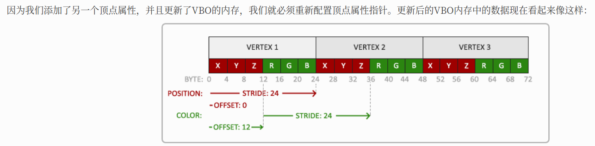

# Shader 着色器

- 着色器(Shader)是运行在GPU上的小程序,这些小程序为图形渲染管线的某个特定部分而运行
- 从基本意义上来说，着色器只是一种把输入转化为输出的程序
- 着色器也是一种非常独立的程序，因为它们之间不能相互通信；它们之间唯一的沟通只有通过输入和输出

## GLSL

着色器是使用一种叫GLSL的类C语言写成的。GLSL是为图形计算量身定制的，它包含一些针对向量和矩阵操作的有用特性

- 顶点着色器（Vertex Shader）:主要负责处理输入的顶点坐标，并对这些顶点进行变换
- 片段着色器（Fragment Shader）：主要负责处理图形中的每个片段（像素）,计算像素的最终颜色，进行光照计算、纹理映射、颜色插值等
- 着色器的结构：版本声明 + 输入/输出/全局变量 + main函数

一个典型的着色器有下面的结构

```cpp
#version version_number

in type in_variable_name;
in type in_variable_name;

out type out_variable_name;

uniform type uniform_name;

int main()
{
  // 处理输入并进行一些图形操作
  ...
  // 输出处理过的结果到输出变量
  out_variable_name = weird_stuff_we_processed;
}
```

GLSL是为图形计算量身定制的，它包含一些针对向量和矩阵操作的有用特性

- 当我们特别谈论到顶点着色器的时候，每个输入变量也叫顶点属性(Vertex Attribute)

## GLSL 数据类型

GLSL中包含C等其它语言大部分的默认基础数据类型：int、float、double、uint和bool。GLSL也有两种容器类型，它们会在这个教程中使用很多，分别是向量(Vector)和矩阵(Matrix)

|类型|含义|
|---|---|
|vecn|包含n个float分量的默认向量|
|bvecn|包含n个bool分量的向量|
|ivecn|包含n个int分量的向量|
|uvecn|包含n个unsigned int分量的向量|
|dvecn|包含n个double分量的向量|

- 大多数时候我们使用vecn，因为float足够满足大多数要求了
- 一个向量的分量可以通过vec.x这种方式获取，这里x是指这个向量的第一个分量,你可以分别使用.x、.y、.z和.w来获取它们的第1、2、3、4个分量
- GLSL也允许你对颜色使用rgba，或是对纹理坐标使用stpq访问相同的分量

向量这一数据类型也允许一些有趣而灵活的分量选择方式，叫做重组(Swizzling)。重组允许这样的语法

```text
vec2 someVec;
vec4 differentVec = someVec.xyxx;
vec3 anotherVec = differentVec.zyw;
vec4 otherVec = someVec.xxxx + anotherVec.yxzy;
// -------------------------------------------------
vec2 vect = vec2(0.5f, 0.7f);
vec4 result = vec4(vect, 0.0f, 0.0f);
vec4 otherResult = vec4(result.xyz, 1.0f);
```

## 着色器的输入与输出

- 每个着色器都可以有输入和输出，这样才能进行数据交流和传递。GLSL定义了in和out关键字专门来实现这个目的
- 每个着色器使用这两个关键字设定输入和输出，只要一个输出变量与下一个着色器阶段的输入匹配，它就会传递下去。但在顶点和片段着色器中会有点不同
- 顶点着色器应该接收的是一种特殊形式的输入，否则就会效率低下
- **顶点着色器的输入特殊在，它从顶点数据中直接接收输入**
- 为了定义顶点数据该如何管理，我们使用location这一元数据指定输入变量，这样我们才可以在CPU上配置顶点属性`layout (location = 0)`
- 顶点着色器需要为它的输入提供一个额外的layout标识，这样我们才能把它链接到顶点数据

> 你也可以忽略layout (location = 0)标识符，通过在OpenGL代码中使用glGetAttribLocation查询属性位置值(Location)

- 另一个例外是片段着色器，它需要一个vec4颜色输出变量，因为片段着色器需要生成一个最终输出的颜色。如果你在片段着色器没有定义输出颜色，OpenGL会把你的物体渲染为黑色（或白色）
- 所以，如果我们打算从一个着色器向另一个着色器发送数据，我们必须**在发送方着色器中声明一个输出，在接收方着色器中声明一个类似的输入。当类型和名字都一样的时候，OpenGL就会把两个变量链接到一起**，它们之间就能发送数据了（这是在链接程序对象时完成的）。

例子: 让顶点着色器为片段着色器决定颜色

顶点着色器

```text
#version 330 core
layout (location = 0) in vec3 position; // position变量的属性位置值为0

out vec4 vertexColor; // 为片段着色器指定一个颜色输出

void main()
{
    gl_Position = vec4(position, 1.0); // 注意我们如何把一个vec3作为vec4的构造器的参数
    vertexColor = vec4(0.5f, 0.0f, 0.0f, 1.0f); // 把输出变量设置为暗红色
}
```

片段着色器

```text
#version 330 core
in vec4 vertexColor; // 从顶点着色器传来的输入变量（名称相同、类型相同）

out vec4 color; // 片段着色器输出的变量名可以任意命名，类型必须是vec4

void main()
{
    color = vertexColor;
}
```

## uniform

- **Uniform是一种从CPU中的应用向GPU中的着色器发送数据的方式**，但uniform和顶点属性有些不同
- uniform是全局的(Global)。全局意味着uniform变量必须在每个着色器程序对象中都是独一无二的,它可以被着色器程序的任意着色器在任意阶段访问
- 无论你把uniform值设置成什么，uniform会一直保存它们的数据，直到它们被重置或更新

可以在一个着色器中添加uniform关键字至类型和变量名前来声明一个GLSL的uniform。从此处开始我们就可以在着色器中使用新声明的uniform了。我们来看看这次是否能通过uniform设置三角形的颜色

```text
#version 330 core
out vec4 color;

uniform vec4 ourColor; // 在OpenGL程序代码中设定这个变量

void main()
{
    color = ourColor;
}  
```

在片段着色器中声明了一个uniform vec4的ourColor，并把片段着色器的输出颜色设置为uniform值的内容。因为uniform是全局变量，我们可以在任何着色器中定义它们，而无需通过顶点着色器作为中介

> 如果你声明了一个uniform却在GLSL代码中没用过，编译器会静默移除这个变量，导致最后编译出的版本中并不会包含它，这可能导致几个非常麻烦的错误

首先需要找到着色器中uniform属性的索引/位置值。当我们得到uniform的索引/位置值后，我们就可以更新它的值了。这次我们不去给像素传递单独一个颜色，而是让它随着时间改变颜色：

```cpp
GLfloat timeValue = glfwGetTime();
GLfloat greenValue = (sin(timeValue) / 2) + 0.5;
GLint vertexColorLocation = glGetUniformLocation(shaderProgram, "ourColor"); // 查询uniform ourColor的位置值, 返回-1表示没找到
glUseProgram(shaderProgram);// 更新一个unform之前需要调用glUseProgram
glUniform4f(vertexColorLocation, 0.0f, greenValue, 0.0f, 1.0f);
```

glUniform函数有一个特定的后缀，标识设定的uniform的类型

|类型|含义|
|---|---|
|f|函数需要一个float作为它的值|
|i|函数需要一个int作为它的值|
|ui|函数需要一个unsigned int作为它的值|
|3f|函数需要3个float作为它的值|
|fv|函数需要一个float向量/数组作为它的值|

分别设定uniform的4个float值，所以我们通过glUniform4f传递我们的数据(注意，我们也可以使用fv版本

如果我们打算让颜色慢慢变化，我们就要在游戏循环的每一次迭代中（所以他会逐帧改变）更新这个uniform，否则三角形就不会改变颜色。下面我们就计算greenValue然后每个渲染迭代都更新这个uniform：

```cpp
while(!glfwWindowShouldClose(window))
{
    // 检测并调用事件
    glfwPollEvents();

    // 渲染
    // 清空颜色缓冲
    glClearColor(0.2f, 0.3f, 0.3f, 1.0f);
    glClear(GL_COLOR_BUFFER_BIT);

    // 记得激活着色器
    glUseProgram(shaderProgram);

    // 更新uniform颜色
    GLfloat timeValue = glfwGetTime();
    GLfloat greenValue = (sin(timeValue) / 2) + 0.5;
    GLint vertexColorLocation = glGetUniformLocation(shaderProgram, "ourColor");
    glUniform4f(vertexColorLocation, 0.0f, greenValue, 0.0f, 1.0f);

    // 绘制三角形
    glBindVertexArray(VAO);
    glDrawArrays(GL_TRIANGLES, 0, 3);
    glBindVertexArray(0);
}
```

## 把颜色数据加进顶点数据

把颜色数据添加为3个float值至vertices数组。我们将把三角形的三个角分别指定为红色、绿色和蓝色

```cpp
GLfloat vertices[] = {
    // 位置              // 颜色
     0.5f, -0.5f, 0.0f,  1.0f, 0.0f, 0.0f,   // 右下
    -0.5f, -0.5f, 0.0f,  0.0f, 1.0f, 0.0f,   // 左下
     0.0f,  0.5f, 0.0f,  0.0f, 0.0f, 1.0f    // 顶部
};
```

由于现在有更多的数据要发送到顶点着色器，我们有必要去调整一下顶点着色器，使它能够接收颜色值作为一个顶点属性输入。需要注意的是我们用layout标识符来把color属性的位置值设置为1：

```text
#version 330 core
layout (location = 0) in vec3 position; // 位置变量的属性位置值为 0 
layout (location = 1) in vec3 color;    // 颜色变量的属性位置值为 1

out vec3 ourColor; // 向片段着色器输出一个颜色

void main()
{
    gl_Position = vec4(position, 1.0);
    ourColor = color; // 将ourColor设置为我们从顶点数据那里得到的输入颜色
}
```

由于我们不再使用uniform来传递片段的颜色了，现在使用ourColor输出变量，我们必须再修改一下片段着色器

```text
#version 330 core
in vec3 ourColor;
out vec4 color;

void main()
{
    color = vec4(ourColor, 1.0f);
}
```

因为我们添加了另一个顶点属性，并且更新了VBO的内存，我们就必须重新配置顶点属性指针。更新后的VBO内存中的数据现在看起来像这样：



知道了现在使用的布局，我们就可以使用glVertexAttribPointer函数更新顶点格式

```cpp
// 位置属性
glVertexAttribPointer(0, 3, GL_FLOAT, GL_FALSE, 6 * sizeof(GLfloat), (GLvoid*)0);
glEnableVertexAttribArray(0);
// 颜色属性
glVertexAttribPointer(1, 3, GL_FLOAT, GL_FALSE, 6 * sizeof(GLfloat), (GLvoid*)(3* sizeof(GLfloat)));
glEnableVertexAttribArray(1);
```

glVertexAttribPointer函数的前几个参数比较明了。这次我们配置属性位置值为1的顶点属性。颜色值有3个float那么大，我们不去标准化这些值。

由于我们现在有了两个顶点属性，我们不得不重新计算步长值。为获得数据队列中下一个属性值（比如位置向量的下个x分量）我们必须向右移动6个float，其中3个是位置值，另外3个是颜色值。这使我们的步长值为6乘以float的字节数（=24字节）。
同样，这次我们必须指定一个偏移量。对于每个顶点来说，位置顶点属性在前，所以它的偏移量是0。颜色属性紧随位置数据之后，所以偏移量就是3 * sizeof(GLfloat)，用字节来计算就是12字节


## shader class

```cpp
#ifndef SHADER_H
#define SHADER_H

#include <string>
#include <fstream>
#include <sstream>
#include <iostream>

#include <GL/glew.h>

class Shader
{
public:
    GLuint Program;
    // Constructor generates the shader on the fly
    Shader(const GLchar* vertexPath, const GLchar* fragmentPath)
    {
        // 1. Retrieve the vertex/fragment source code from filePath
        std::string vertexCode;
        std::string fragmentCode;
        std::ifstream vShaderFile;
        std::ifstream fShaderFile;
        // ensures ifstream objects can throw exceptions:
        vShaderFile.exceptions (std::ifstream::badbit);
        fShaderFile.exceptions (std::ifstream::badbit);
        try
        {
            // Open files
            vShaderFile.open(vertexPath);
            fShaderFile.open(fragmentPath);
            std::stringstream vShaderStream, fShaderStream;
            // Read file's buffer contents into streams
            vShaderStream << vShaderFile.rdbuf();
            fShaderStream << fShaderFile.rdbuf();
            // close file handlers
            vShaderFile.close();
            fShaderFile.close();
            // Convert stream into string
            vertexCode = vShaderStream.str();
            fragmentCode = fShaderStream.str();
        }
        catch (std::ifstream::failure e)
        {
            std::cout << "ERROR::SHADER::FILE_NOT_SUCCESFULLY_READ" << std::endl;
        }
        const GLchar* vShaderCode = vertexCode.c_str();
        const GLchar * fShaderCode = fragmentCode.c_str();
        // 2. Compile shaders
        GLuint vertex, fragment;
        GLint success;
        GLchar infoLog[512];
        // Vertex Shader
        vertex = glCreateShader(GL_VERTEX_SHADER);
        glShaderSource(vertex, 1, &vShaderCode, NULL);
        glCompileShader(vertex);
        // Print compile errors if any
        glGetShaderiv(vertex, GL_COMPILE_STATUS, &success);
        if (!success)
        {
            glGetShaderInfoLog(vertex, 512, NULL, infoLog);
            std::cout << "ERROR::SHADER::VERTEX::COMPILATION_FAILED\n" << infoLog << std::endl;
        }
        // Fragment Shader
        fragment = glCreateShader(GL_FRAGMENT_SHADER);
        glShaderSource(fragment, 1, &fShaderCode, NULL);
        glCompileShader(fragment);
        // Print compile errors if any
        glGetShaderiv(fragment, GL_COMPILE_STATUS, &success);
        if (!success)
        {
            glGetShaderInfoLog(fragment, 512, NULL, infoLog);
            std::cout << "ERROR::SHADER::FRAGMENT::COMPILATION_FAILED\n" << infoLog << std::endl;
        }
        // Shader Program
        this->Program = glCreateProgram();
        glAttachShader(this->Program, vertex);
        glAttachShader(this->Program, fragment);
        glLinkProgram(this->Program);
        // Print linking errors if any
        glGetProgramiv(this->Program, GL_LINK_STATUS, &success);
        if (!success)
        {
            glGetProgramInfoLog(this->Program, 512, NULL, infoLog);
            std::cout << "ERROR::SHADER::PROGRAM::LINKING_FAILED\n" << infoLog << std::endl;
        }
        // Delete the shaders as they're linked into our program now and no longer necessery
        glDeleteShader(vertex);
        glDeleteShader(fragment);

    }
    // Uses the current shader
    void Use() 
    { 
        glUseProgram(this->Program); 
    }
};

#endif
```

我们把顶点和片段着色器储存为两个叫做shader.vs和shader.frag的文件。你可以使用自己喜欢的名字命名着色器文件

- [shader](https://learnopengl-cn.readthedocs.io/zh/latest/01%20Getting%20started/05%20Shaders/#_5)
